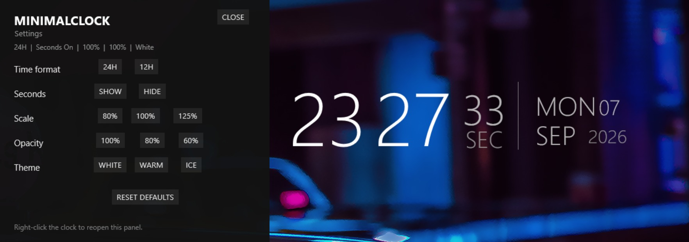

<div align="center">

# MinimalClock

**A tiny Windows desktop utility, finished with the same discipline as a larger product.**

[](https://github.com/marcelosofficial-ctrl/MinimalClock/actions/workflows/ci.yml)


[Portfolio case study](https://marcelosofficial-ctrl.github.io/portfolio/projects/rainmeter-clock/) · [Performance methodology](docs/PERFORMANCE.md) · [Release packaging](docs/PACKAGING.md)

</div>


A lightweight, typography-first desktop clock for Windows, built natively for Rainmeter with a dependency-free browser implementation of the same design.

MinimalClock started as a personal desktop clock and became an exercise in finishing a small utility properly: restrained architecture, persistent settings, measurable performance, automated validation, release packaging, and a second implementation in plain HTML/CSS/JavaScript.

## What it looks like


The native settings panel keeps configuration inside Rainmeter rather than requiring users to edit source files.



## Features

- native Rainmeter implementation with no plugins or network measures
- 12-hour and 24-hour modes
- optional seconds with automatic layout reflow
- 80%, 100%, and 125% scale presets
- persistent 100%, 80%, and 60% opacity presets
- White, Warm, and Ice themes
- native Rainmeter settings panel and reset-to-defaults control
- dependency-free HTML/CSS/JavaScript browser version
- browser settings persisted with `localStorage`
- repeatable CPU and memory benchmarking tools
- Windows GitHub Actions validation
- no Electron, Node.js runtime, embedded WebView, or background service

## Why native Rainmeter?

An HTML renderer was considered for the desktop version, but the application only needs local time and text rendering. Rainmeter already provides both. Embedding a browser runtime would add memory use and complexity without improving the core job.

The web version exists separately because it makes the design portable to a browser and demonstrates the same interface in plain frontend code.

That decision reflects one of the project's main engineering goals: use the smallest tool that solves the problem well.

## Performance

MinimalClock was benchmarked against the Rainmeter process with the skin unloaded, with seconds hidden, and with seconds shown. Each scenario was sampled for 45 seconds on the same system.

| Scenario | Avg CPU | Avg working set | Avg private memory |
| --- | ---: | ---: | ---: |
| Rainmeter baseline | 0.0029% | 57.86 MB | 67.08 MB |
| MinimalClock, seconds off | 0.0086% | 60.03 MB | 67.45 MB |
| MinimalClock, seconds on | 0.0287% | 60.21 MB | 67.53 MB |

Measured Rainmeter-process overhead versus baseline:

- **Seconds hidden:** +0.0057 percentage points CPU, +2.17 MB working set
- **Seconds shown:** +0.0258 percentage points CPU, +2.35 MB working set

Test system: Windows 11 Home, AMD Ryzen 5 7500F, 31.6 GB RAM, 12 logical processors.

These are measurements from one machine, not universal requirements. See [`docs/PERFORMANCE_RESULTS.md`](docs/PERFORMANCE_RESULTS.md) and [`docs/PERFORMANCE.md`](docs/PERFORMANCE.md) for the results and methodology.

## Installation

The recommended installation method is the packaged `.rmskin` installer from the GitHub Releases page. Open the installer and let Rainmeter add the skin, then load `MinimalClock.ini` if it is not already active.

For manual installation, copy the `MinimalClock` folder to:

```text
Documents\Rainmeter\Skins\MinimalClock
```

Refresh Rainmeter and load `MinimalClock.ini`. Right-click the clock and choose **MinimalClock settings...** to open the native settings panel.

Rainmeter itself can launch with Windows, so MinimalClock does not install a separate startup service or scheduled task.

## Browser version

Open `web/index.html` directly. There is no build step, package manager, or local server requirement.

The browser implementation uses plain HTML, CSS, and JavaScript. Its timer continually realigns updates to real second boundaries instead of relying on a free-running interval, and settings persist with `localStorage`.

## Project structure

```text
MinimalClock/
├── MinimalClock/               Native Rainmeter application
│   ├── MinimalClock.ini
│   ├── Settings/
│   │   └── Settings.ini
│   └── @Resources/
│       └── Settings.inc
├── web/                        Browser implementation
│   ├── index.html
│   ├── styles.css
│   └── app.js
├── screenshots/                Release screenshots
├── tools/                      Validation, install, and benchmark scripts
├── docs/                       Architecture, performance, and release notes
├── packaging/                  Rainmeter package metadata reference
├── CHANGELOG.md
├── LICENSE
└── README.md
```

The native version separates user configuration, time measures, rendering, and developer tooling. `Settings.inc` is the persistent source of truth for user choices, while the main INI remains focused on the clock itself.

## Validation

Run the local validation suite with:

```powershell
.\tools\validate-project.ps1
```

The repository also contains a Windows GitHub Actions workflow that runs validation on pushes and pull requests. It checks the Rainmeter project structure, required files, accidental font binaries, and browser JavaScript syntax when Node.js is available.

## Reproducing the benchmark

From the project root in PowerShell:

```powershell
.\tools\benchmark-suite.ps1 -Seconds 45
```

The script guides the user through three matching scenarios and generates CSV and Markdown output.

## Fonts

The public version uses `Segoe UI Light`, a Windows system font. No third-party font binary is distributed with the repository. See [`THIRD_PARTY.md`](THIRD_PARTY.md).

## Release packaging

The installer is built with Rainmeter's Skin Packager rather than by renaming a ZIP file. Packaging notes and the release checklist are in:

- [`docs/PACKAGING.md`](docs/PACKAGING.md)
- [`docs/RELEASE_CHECKLIST.md`](docs/RELEASE_CHECKLIST.md)
- [`docs/GITHUB_RELEASE.md`](docs/GITHUB_RELEASE.md)
- [`CHANGELOG.md`](CHANGELOG.md)

## What I learned

The project intentionally stays small, but it touches several useful engineering concerns: configuration as state, separation of concerns, optical UI alignment, avoiding unnecessary dependencies, benchmarking a non-functional requirement, regression validation after a real runtime bug, CI, and release engineering.

More detailed notes are available in [`docs/ARCHITECTURE.md`](docs/ARCHITECTURE.md) and [`docs/LEARNING_NOTES.md`](docs/LEARNING_NOTES.md).

## License

MIT. See [`LICENSE`](LICENSE).
